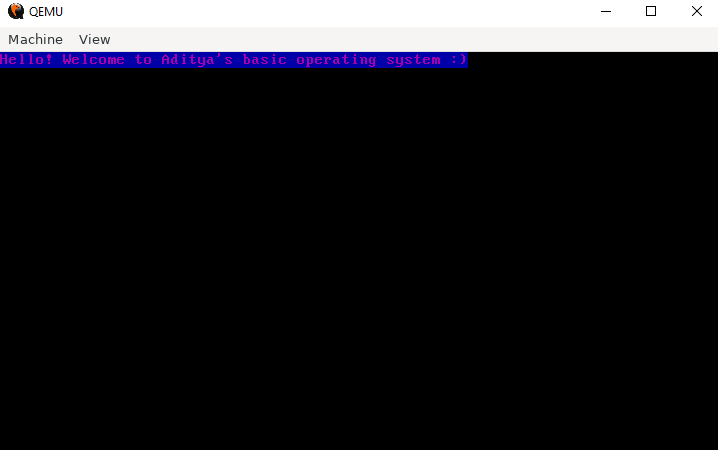

# My operating system
A kernel for a basic operating system. Assembly language assembeled using the Netwide Assembler (NASM). GNU Compiler Collection (GCC) was used to cross compile C++ code. QEMU was used to emulate a computer to run the operating system. 

## To use in QEMU
Use this command in terminal:
qemu-system-x86_64 OS.bin
